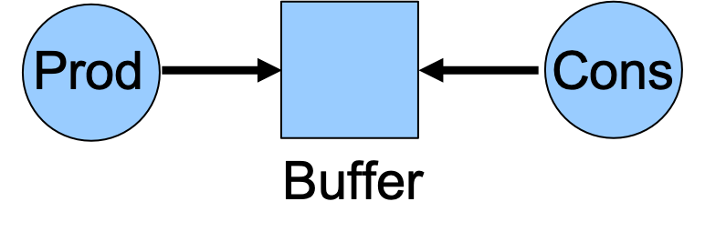

# Produttore-Consumatore singolo buffer

Nel problema produttore-consumatore, abbiamo due categorie di processi:

- **Produttori**, che scrivono un messaggio su di una risorsa condivisa
- **Consumatori**, che prelevano il messaggio dalla risorsa condivisa

Pur esistendo un problema(potenziale) di mutua esclusione nell'utilizzo del buffer comune, la soluzione impone un ordinamento nelle operazioni. È necessario che produttori e consumatori si scambino segnali per indicare  rispettivamente l'avvenuto deposito e prelievo. Ciascuno dei due processi deve attendere per completare la sua azione, l'arrivo del segnale dell'altro processo.

---

#### Esercizio
Scrivere un'applicazione concorrente che implementi  il problema dei Produttori/Consumatori. Il programma crei dei processi che agiscano da produttore e consumatore utilizzando un uunico buffer di memoria in cui sono memorizzati valori di tipo intero. Il buffer di memoria è creato attraverso una shared memory e la sicronizzazione tra produttori e consumatori deve avvenire tramite l'utlizzo di semafori.

I vincoli che caratterizzano il problema produttore-consumatore a singolo buffer sono i seguenti:

- Il produttore non può produrre un messaggio prima che qualche consumatore abbia letto il messaggio precedente.
- Il consumatore non può  prelevare alcun messaggio fino a che un produttore non l'abbia depositato.



Per la sincronizzazione dei processi produttore e consumatore si utilizzano due semafori:
- `SPAZIO DISPONIBILE`:semaforo bloccato da un produttore prima di una produzione, e sbloccato da un consumatore in seguito ad un consumo. Il valore iniziale del semaforo deeve essere pari ad `1`;
- `MESSAGGIO DISPONIBILE`: semaforo sbloccato da un produttore in seguito ad una produzione, e bloccato da un consumatore prima del consumo. Il valore iniziale del semaforo deve essere pari `0`.

La produzione e di il consumo avvengono rispetittivamente all'interno delle procedure:

```c
void produttore(int *, int);
void consumatore(int *, int);
```
Dove, il primo argomento è un puntatore a interi della shared memory creata, mentre il secondo parametro indica il descrittore del semaforo da utlizzare per le operazioni di wait() su semaforo e signal() su semaforo, necessarie per la cooperazione tra produttore e consumatore. Il valore prodotto è un intero generato tramite la funzione `rand()`.


